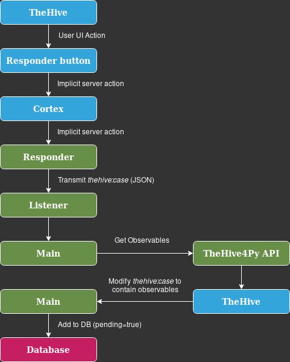

# YARA-Designer Core (backend)

## Dependencies
### Git repository
The following Git repository must be set up and available.
- TheOracle (YARA rules git repository)
### Projects
The following projects must be running and available over network.
- yara-designer-responder (Cortex responder)
- yara-designer-web (Web GUI, frontend)

## Setup
1. Set up an environment using [Pipenv](https://pipenv.pypa.io/en/latest/) (recommended) or [Virtualenv](https://packaging.python.org/guides/installing-using-pip-and-virtual-environments/):
    - Pipenv:
        ```console
        # Install environment.
        $ pipenv install
        # Install and update dependencies.
        $ pipenv update
        ```
    - Virtualenv
        ```console
        # Install environment.
        $ python3 -m venv env
        # Enable environment.
        $ source env/bin/activate
        # Install dependencies.
        $ pip install -r requirements.txt
        ```
2. Create a `config.json` and configure it (use `config.json.sample` as reference).
    - NB: You don't need to specify every option, just the ones you want to override.
3. Make sure Cortex is set up with `yara-designer-responder` and is available over network.

## Usage
1. Start the YARA-Designer core/backend by running `main.py`:
    - Pipenv: `pipenv run python3 main.py`.
    - Virtualenv: `source env/bin/activate` and then `python3 main.py`.
2. Use the Cortex responder on a case in TheHive, which will populate core's database.

## API
For documentation on the API start the server and visit `http://<host>:<port>/api/v1/`

## Workflow


