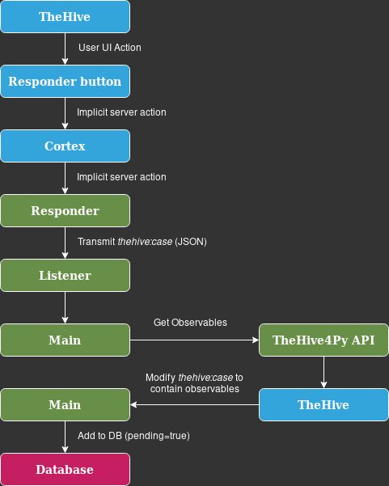

# Yara Whitelist Rule Creator

## Requirements
### Other repositories
- TheOracle

## TheHive/Cortex Responder

This responder sends a `thehive:case` to a listener which then creates
a Yara rule based on it.

#### Set up on thehive and cortex host:

NB: The system needs to have cortexutils installed!
Install it using pip (both py2 and py3, to be sure):
```
pip install cortexutils
pip3 install cortexutils
```

#### Setup
1. Upload the `responder/` directory as `/opt/Cortex-Analyzers/responders/` on the remote host.
2. Restart cortex and thehive.
3. Enable the responder in cortex.

#### Usage
1. Start the listener.
2. Use the responder on a case.

## Workflow



## YARA Rule Designer

## Workflow
